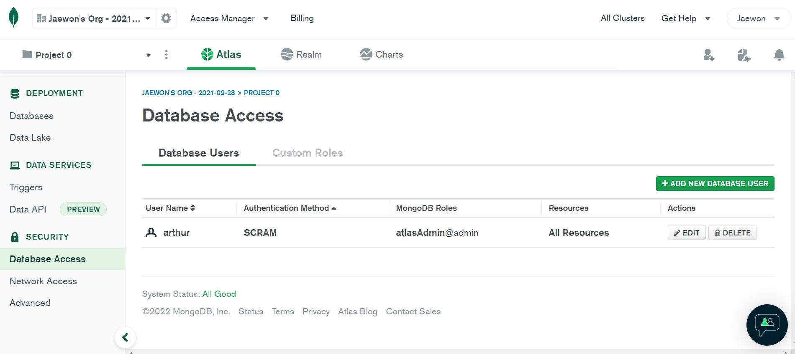

# 21 - 22 VandyApps Intro FSD

**Hello Everyone !**

I will use this repo to update the most "stable" version of our work so far, meaning that I tested and verified the functionality of all the files along with comments to help refresh your memory. It is very unlikely that the files contain any errors (or so I hope) and so if you encounter an error after downloading this repo a lot of it may be environment issues. Some major sources of errors could be,

1. Not having the correct Node.js or JavaScript runtime environment.
2. Not downloading all depencies listed in package.json.
3. Running the wrong start command, should be "npm run start" or "npm run backend" if you wish to use nodemon.
4. Running the start command in the wrong directory.

## Instuctions before running the Backend
1. Travel to the directory containing all the source code. For example, if your 'IntroFSD' folder contains package.json, index.js, middleware, and auth, you want to be at the IntroFSD folder.
2. Next, open a new terminal using from the menu bar 'Terminal', or press Ctrl + Shift + ` .
3. Type 'npm install' and press enter. What this does is access the package.json file, see what dependencies are used in this project, and then automatically install all the packages for you from the package.json file. Much faster than typing the packages individually like 'npm install express', 'npm install mongoose', and so on.
4. Then go to 'index.js' and the 33rd line where we declare the variable "mongoURI". Inside the string, replace the {Your ID}, {Your Password}, {Your desired DB name} with your information that can be retrieved at MongoDB. If you forgot your ID or password, access the location below to delete and create a new user.

5. Then open the terminal and type "npm run backend" to start the server.